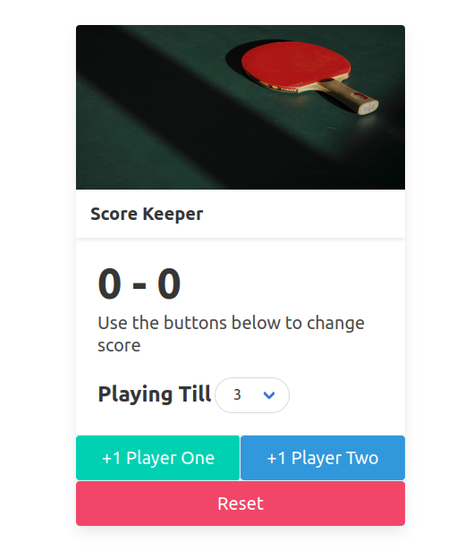

# Score-Keeper
https://scorekeeper04.netlify.app/
is an interactive website to record scores of two players. It is written using pure vanilla JavaScript, HTML, and CSS open-source framework 'Bulma'.

User can select winning score and add each score accordingly till a player wins.
Reset button resets score for each player.

